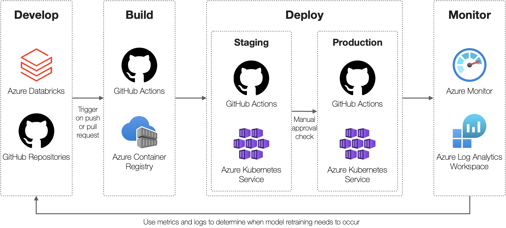

# Proof-of-Concept: Employee Retention with Databricks and Kubernetes

## Overview

This repository contains resources for an end-to-end proof of concept which illustrates how an MLFlow model can be trained on Azure Databricks, packaged as a web service, deployed to Kubernetes via CI/CD, and monitored within Microsoft Azure. A high-level solution design is shown below:

Within Azure Databricks, the `IBM HR Analytics Employee Attrition & Performance` [dataset](https://www.kaggle.com/pavansubhasht/ibm-hr-analytics-attrition-dataset) available from Kaggle will be used to develop and register a machine learning model. This model will predict the likelihood of attrition for an employee along with metrics capturing data drift and outliers to access the model's validity.

This model will then be deployed as an API for real-time inference using Azure Kubernetes  Service. This API can be integrated with external applications used by HR teams to provide additional insights into the likelihood of attrition for a given employee within the organization. This information can be used to determine if a high-impact employee is likely to leave the organization and hence provide HR with the ability to proactively incentivize the employee to stay.

> For additional insights into applying this approach to operationalize your machine learning workloads refer to this article — [Machine Learning at Scale with Databricks and Kubernetes](https://techcommunity.microsoft.com/t5/azure-ai-blog/machine-learning-at-scale-with-databricks-and-kubernetes/ba-p/3056539)

## Getting Started

This repository contains detailed step-by-step instructions on how to implement this solution in your Microsoft Azure subscription. At a high-level an implementation contains four main stages:

- **Infrastructure Setup:** this includes an Azure Databricks workspace, an Azure Log Analytics workspace, an Azure Container Registry, and 2 Azure Kubernetes clusters (for a staging and production environment respectively).

- **Model Development:** this includes core components of the model development process such as experiment tracking and model registration. An Azure Databricks Workspace will be used to develop three MLFlow models to generate predictions, access data drift and determine outliers.

- **Model Deployment:** this includes implementing a CI/CD pipeline with GitHub Actions to package a MLFlow model as an API for model serving. [FastAPI](https://fastapi.tiangolo.com) will be used to develop the web API for deployment. This will be containerized and deployed on separate Azure Kubernetes clusters for Staging and Production respectively.

- **Model Monitoring:** this includes using Azure Monitor for containers to monitor the health and performance of the API. In addition, Log Analytics will be used to monitor data drift and outliers by analysing log telemetry.

For detailed step-by-step instructions see the [Implementation Guide](.github/docs/implementation-guide.md).

## Contributing

This project welcomes contributions and suggestions.  Most contributions require you to agree to a
Contributor License Agreement (CLA) declaring that you have the right to, and actually do, grant us
the rights to use your contribution. For details, visit https://cla.opensource.microsoft.com.

When you submit a pull request, a CLA bot will automatically determine whether you need to provide
a CLA and decorate the PR appropriately (e.g., status check, comment). Simply follow the instructions
provided by the bot. You will only need to do this once across all repos using our CLA.

This project has adopted the [Microsoft Open Source Code of Conduct](https://opensource.microsoft.com/codeofconduct/).
For more information see the [Code of Conduct FAQ](https://opensource.microsoft.com/codeofconduct/faq/) or
contact [opencode@microsoft.com](mailto:opencode@microsoft.com) with any additional questions or comments.

## Trademarks

This project may contain trademarks or logos for projects, products, or services. Authorized use of Microsoft 
trademarks or logos is subject to and must follow 
[Microsoft's Trademark & Brand Guidelines](https://www.microsoft.com/en-us/legal/intellectualproperty/trademarks/usage/general).
Use of Microsoft trademarks or logos in modified versions of this project must not cause confusion or imply Microsoft sponsorship.
Any use of third-party trademarks or logos are subject to those third-party's policies.
